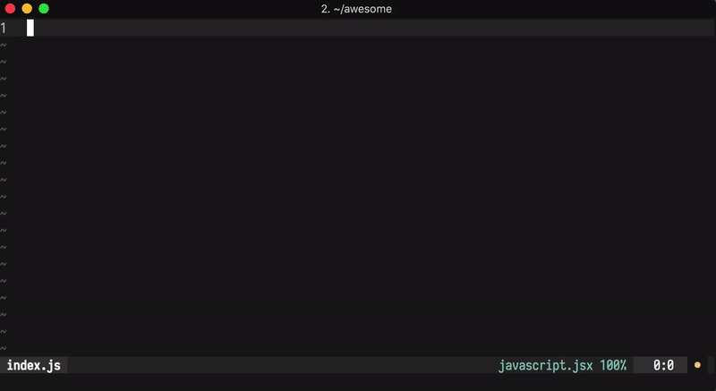

# vim-import-cost

[](https://travis-ci.org/yardnsm/vim-import-cost)



This plugin is a (very rough) port of the [import-cost](https://github.com/wix/import-cost) plugin
for Visual Studio Code. In a nutshell, it calculates the bundle size for each `import` statement or
`require` calls. Thanks to Neovim's virtual text feature, this plugin can show the calculated size
next to the `import` statements, with a fallback to showing the calculated size in a
scratch buffer.

This plugin exposes commands that allows you to calculate the package's size on demand. By default
it'll try to use Neovim's virtual text feature.

This plugin uses the
[`import-cost`](https://github.com/wix/import-cost/tree/master/packages/import-cost) module (also
part of the original import-cost plugin) that uses `webpack` to calculate the size of the imported
module.

You can find more information about how the size calculation process works in [this blog
post](https://hackernoon.com/keep-your-bundle-size-under-control-with-import-cost-vscode-extension-5d476b3c5a76).

## Installation

Use your favorite plugin manager to install this plugin. Make sure to have `node` (>= 8) and `npm`
both installed and available in your `$PATH`.

### Using [vim-plug](https://github.com/junegunn/vim-plug):

```vim
Plug 'yardnsm/vim-import-cost', { 'do': 'npm install' }
```

If you're installing the plugin in different way, make sure to run `npm install` in the root path of
the plugin directory, so the required dependencies will be installed.

## Usage

You can initiate the plugin by demand; it does not offer any automatic calculation out of the box.

- Use the `:ImportCost` command when inside a JavaScript / TypeScript buffer. This commands also
  support ranges, so you can initiate it from VISUAL mode.
- Use the `:ImportCostSingle` command if you wish to process the current line only.
- Use the `:ImportCostClear` command to clear the virtual text set by the plugin.

## Configuration

Find the available configuration methods in the plugin's [help file](./doc/import_cost.txt).

```vim
:help import_cost
```

## FAQ

### How can I automatically run this plugin on buffer updates?

You can all the `:ImportCost` command within an `autocmd`, so it can be triggered when the buffer is
updated. **This is not recommended to use when the virtual text feature is not supported.**

```vim
" Put this in your .vimrc
augroup import_cost_auto_run
  autocmd!
  autocmd InsertLeave *.js,*.jsx,*.ts,*.tsx ImportCost
  autocmd BufEnter *.js,*.jsx,*.ts,*.tsx ImportCost
  autocmd CursorHold *.js,*.jsx,*.ts,*.tsx ImportCost
augroup END
```

---

## License

MIT © [Yarden Sod-Moriah](http://yardnsm.net/)
