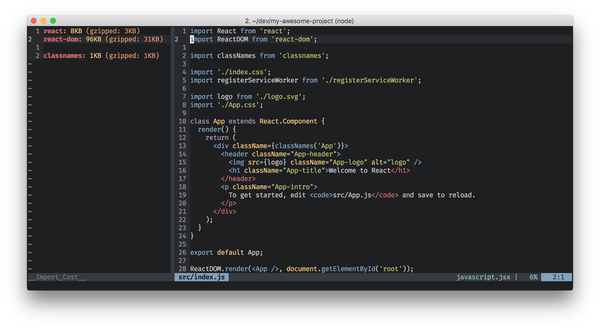

# vim-import-cost

[](https://travis-ci.org/yardnsm/vim-import-cost)



This plugin is a (very rough) port of the [import-cost](https://github.com/wix/import-cost) plugin
for Visual Studio Code. In a nutshell, it calculates the bundle size for each `import` or `require`
statement. However, unlike the original plugin, this plugins does not show the calculated size as
inline text. Instead, it exposes commands that allows you to calculate the package's size on demand.

This plugin uses the
[`import-cost`](https://github.com/wix/import-cost/tree/master/packages/import-cost) module (also
part of the origin import-cost plugin) that uses `webpack` to calculate the size of the imported
module.

You can find more information about how the size calculation process works in [this blog
post](https://hackernoon.com/keep-your-bundle-size-under-control-with-import-cost-vscode-extension-5d476b3c5a76).

> Note: this plugin is still a work-in-progress!

## Installation

Use your favorite plugin manager to install this plugin. Make sure to have `node` (>= 8) and `npm`
both installed and available in your `$PATH`.

### Using [vim-plug](https://github.com/junegunn/vim-plug):

```vim
Plug 'yardnsm/vim-import-cost', { 'do': 'npm install' }
```

If you're installing the plugin in different way, make sure to run `npm install` in the root path of
the plugin directory, so the required dependencies will be installed.

## Usage

Use the `:ImportCost` command when inside a JavaScript / TypeScript buffer. This commands also
support ranges, so you can initiate it from VISUAL mode.

Use the `:ImportCostSingle` command if you wish to process the current line only.

## Configuration

Find the available configuration methods in the plugin's [help file](./doc/import_cost.txt).

```vim
:help import_cost
```

---

## License

MIT © [Yarden Sod-Moriah](http://yardnsm.net/)
